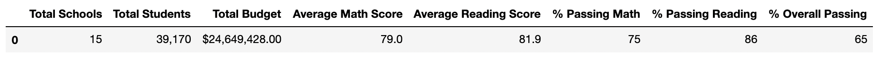
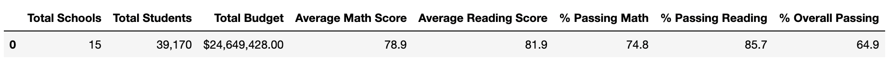

# School District Analysis

## Project Overview
The purpose of this project was to assist a school district with analyzing standardized test scores for math and reading subjects to determine trends in performance. The results of this analysis would provide the school district with meaningful school performance data to determine budget plans for the next school year.

Utilizing Jupyter Notebook and the pandas library, the standarized test score data was organized by school, by grade, by school type, school size and school budget to compare performance and identify trends based on these classifications. Additionally, to make the analysis presentable, the data was cleaned to standardize naming conventions as well as number formatting. The last step was to remove test data for one school which may have been comprimised. Removing this potentially inaccurate data ensured that the final analysis was as accurate as possible. 

## Project Results 
### District Analysis
- Data from two dataframes, one with school data and another with student data (available for reference in the "Resources" folder), were merged in order to determine the number of students within the school district in addition to number of schools within the district. 
- The data was then analyzed to determine the average reading and math scores as well as the percent of students passing either math, reading, or both math and reading (based on the passing threshold of 70%). 
- This output provided a high-level indication of how the schools within the district were performing as a whole, before digging deeper into individual school performance. 
- The data was then manipulated to remove the grades for Thomas High School 9th graders, which was determined to be inaccurate. The results were compared to determine how the performance data was affected by this update.
- The updated analysis showed a slightly lower passing percentage by subject and overall. The difference was slight with this view, but given that the district view includes all schools, a change to remove data for one grade from one school may not make a meaningful difference.

Original disctrict analysis outcome:
 
 
 Updated district analysis outcome:
 
 
 ### School Analysis
