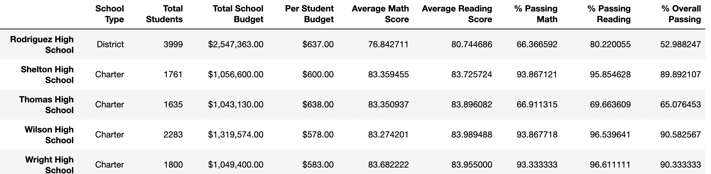

# School District Analysis

## Project Overview
The purpose of this project was to assist a school district with analyzing standardized test scores for math and reading subjects to determine trends in performance. The results of this analysis would provide the school district with meaningful school performance data to determine budget plans for the next school year.

Utilizing Jupyter Notebook and the pandas library, the standarized test score data was organized by school, by grade, by school type, school size and school budget to compare performance and identify trends based on these classifications. Additionally, to make the analysis presentable, the data was cleaned to standardize naming conventions as well as number formatting. The last step was to remove test data for one school which may have been comprimised. Removing this potentially inaccurate data ensured that the final analysis was as accurate as possible. 

## Project Results 
### District Analysis
- Data from two dataframes, one with school data and another with student data (available for reference in the "Resources" folder), were merged in order to determine the number of students within the school district in addition to number of schools within the district. 
- The data was then analyzed to determine the average reading and math scores as well as the percent of students passing either math, reading, or both math and reading (based on the passing threshold of 70%). 
- This output provided a high-level indication of how the schools within the district were performing as a whole, before digging deeper into individual school performance. 
- The data was then manipulated to remove the grades for Thomas High School 9th graders, which was determined to be inaccurate. The results were compared to determine how the performance data was affected by this update.
- The updated analysis showed a slightly lower passing percentage by subject and overall. The difference was slight with this view, but given that the district view includes all schools, a change to remove data for one grade from one school may not make a meaningful difference.

Original disctrict analysis outcome:
 
 
 Updated district analysis outcome:
 
 
 ### School Analysis
 - When drilling down to the individual school level, we can see how updating the 9th grade scores for Thomas High School affected their overall performance scores. 
 - Replacing the 9th grade data to NaN values caused the % passing math and % passing reading rates to decline, with their overall passing % changing from 90.9% to 65.1% 
 - Below, you'll find the before and after school comparison charts. This illustrates how much the performance at the idividual school level was affected by the data manipulation process. 
 
 Thomas High School performance before updating 9th grade data:
 
 
 Thomas High performance after updating 9th grade data:
 
 
 - After understanding how much the Thomas High performance was affected after replacing the grades with NaN values, the decision was made to perform the school analysis after removing the 9th grade student count from Thomas High performance entirely and looking only at the student count from 10-12th grade.
 
 ## Summary 
 - After running the school analysis with the adjusted data, the analysis showed that the schools with the lowest spending ranges per student had a higher overall passing rate than the schools which had a higher per capita spend.
 - Here is a code snippet for determining the spending bins for this analysis:
 ```
 # Establish the spending bins and group names.
spending_bins = [0, 585, 630, 645, 675]
per_school_capita.groupby(pd.cut(per_school_capita, spending_bins)).count()

spending_bins = [0, 585, 630, 645, 675]
group_names = ["<$584", "$585-629", "$630-644", "$645-675"]

# Categorize spending based on the bins.
per_school_summary_df["Spending Ranges (Per Student)"] = pd.cut(per_school_capita, spending_bins, labels=group_names)

per_school_summary_df
```

- The analysis also showed that the average passing rates for small and medium sized schools were much higher compared to large schools. The difference between medium and large schools was most drastic, with the overall passing percentage for medium schools (1000-2000 students) falling at 90.5% compared to large schools (2000-5000 students) at 58.3%

- Finally, the analysis showed that Charter schools have a significantly higher overall passing rate compared to District schools.
- Based on these findings, the school district should consider providing more finding to district schools with larger school populations to help improve test scores. However, they should not put too much funding into one school compared to others, as the analysis did reveal that spending significantly more per student did not result in higher passing rates. Spreading the funding acroos larger school populations will likely have the most impact.
 
